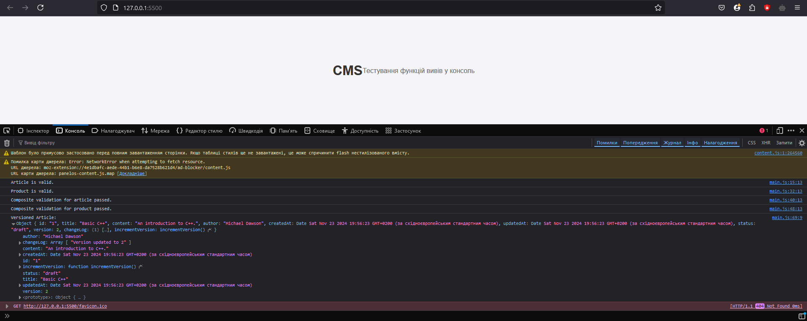

# Development of basic components of an online store using Generic types in TypeScript 

## Repository Overview

Design a type system for a content management platform (CMS) using advanced TypeScript features. The project focuses on creating a type-safe architecture to manage various content types, access control, validation, and versioning.

## Steps Completed

1. **Branch Creation**:
    - Created a new branch `feature/lb5/cms` from the `feature/pr5/generic` branch.

2. **TypeScript Installation**:
    - Installed TypeScript in the `feature/lb5/cms` branch using the following command:
      ```bash
      npm install typescript
      ```
    - Initialized a `tsconfig.json` file using:
      ```bash
      npx tsc --init
      ```

3. **Creating Content Types**:
   - Defined a base content type, `BaseContent`, which includes essential fields such as `id`, `createdAt`, `updatedAt`, `publishedAt` and `status`. Building on this, specific content types like `Article` and `Product` were created, each extending `BaseContent` and adding type-specific fields.

4. **Creating Content Operations**:
   - Implemented generic operations using `ContentOperations<T extends BaseContent>`, which handle various actions like creating, updating, and deleting content. This ensures flexibility across different content types.

5. **Developing Access Control**:
   - Defined a `Role` and `Permission` system to manage access. Created functions to assign roles and check permissions, ensuring secure and appropriate access control for different content types.

6. **Using the Functions**:
   - Created test data for various content types and demonstrated the functionality of developed operations. This included creating and managing content, showcasing the system's ability to handle different content categories securely.

7. **Requirements**:
   - **Type-Safe Functions**:
     To ensure type safety, TypeScript's powerful type system was utilized. By defining specific types like `BaseContent`, `Article`, and `Product`, each function operates on well-defined data structures. The use of generics, such as in `ContentOperations<T extends BaseContent>`, allows these functions to handle various content types while maintaining strict type constraints. This prevents errors from incorrect data handling and ensures predictable behavior with any valid input.

   - **Using Functions Only (No Classes)**:
     Functions are used exclusively for all operations, following a functional programming paradigm. This approach simplifies the code by avoiding the complexities of class-based object-oriented programming. Functions are designed to be pure and reusable, focusing on input-output transformations without maintaining internal state.

   - **Adding Comments to Functions**:
     Each function in the project is accompanied by comments explaining its purpose, parameters, and return values.

   - **Validating Input Data**:
     Input validation is crucial to ensure data integrity and prevent runtime errors. For example, validation functions check if required fields are present and if values meet expected formats. These checks handle edge cases gracefully and provide meaningful feedback in case of invalid input.

8. **Testing**


## Repository Link

[GitHub Repository Link](https://github.com/KpoJleBapKa/kpojlebapka.github.io/tree/feature/lb5/cms)