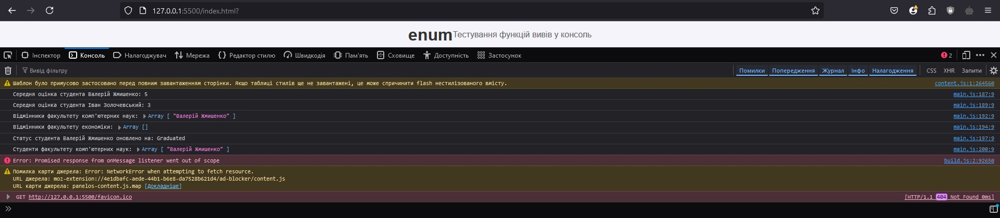

# Development of a University Management System with Type-Safe Architecture

## Repository Overview

This project focuses on developing a type-safe architecture for a University Management System using advanced TypeScript features. The system is designed to manage student registrations, course enrollments, grading, and faculty management, ensuring robust validation and error handling.

## Steps Completed

1. **Branch Creation**:
    - Created a new branch `feature/pr7/enum` from the `feature/lb5/cms` branch.

2. **TypeScript Installation**:
    - Installed TypeScript in the `feature/pr7/enum` branch using the following command:
      ```bash
      npm install typescript
      ```
    - Initialized a `tsconfig.json` file using:
      ```bash
      npx tsc --init
      ```

3. **Defining Enums**:
   - Introduced `enum` types to represent various states and roles within the system, such as `StudentStatus`, `CourseStatus`, `Semester`, `Grade` and `Faculty`. This enhances type safety and readability throughout the codebase.

4. **Implementing Registration Logic**:
   - Developed methods for student registration and course enrollment, including checks for student status and faculty compatibility. This ensures that only eligible students can enroll in courses.

5. **Grading System**:
   - Implemented a grading system with validation to ensure that grades can only be assigned to students who are registered in the corresponding course. This prevents errors related to grade assignments.

6. **Honor Roll Calculation**:
   - Created a method to retrieve a list of honor students based on their average grades within a specific faculty. This functionality allows for easy identification of high-achieving students.

7. **Requirements**:
   1. **Check for Course Registration Eligibility**:
      - Implemented in the `registerForCourse` method, which checks:
        - If the student and course exist.
        - If the student's faculty matches the course's faculty.
        - If the maximum number of students in the course has not been exceeded.

      ```typescript
      if (student.faculty !== course.faculty) {
          throw new Error("Student and course faculties do not match");
      }

      if (course.enrolledStudents >= course.maxStudents) {
          throw new Error("Course is full");
      }
      ```

   2. **Validation When Changing Student Status**:
      - Implemented in the `updateStudentStatus` method, which checks that only active students can be graduated.

      ```typescript
      if (newStatus === StudentStatus.Graduated && student.status !== StudentStatus.Active) {
          throw new Error("Only active students can be graduated");
      }
      ```

   3. **Check for Grade Assignment Eligibility**:
      - Implemented in the `setGrade` method, where before assigning a grade, it checks if the student is registered for the course using the `isStudentRegisteredForCourse` method.

      ```typescript
      if (!this.isStudentRegisteredForCourse(studentId, courseId)) {
          throw new Error("Student is not registered for this course");
      }
      ```

   4. **Method for Retrieving Honor Students by Faculty**:
      - Implemented in the `getHonorStudents` method, which returns a list of students with an average grade of 4.5 or higher for the specified faculty.

      ```typescript
      return this.students.filter(student => {
          const averageGrade = this.calculateAverageGrade(student.id);
          return student.faculty === faculty && averageGrade >= 4.5;
      });
      ```

8. **Testing**


## Repository Link

[GitHub Repository Link](https://github.com/KpoJleBapKa/kpojlebapka.github.io/tree/feature/pr7/enum)
